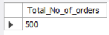
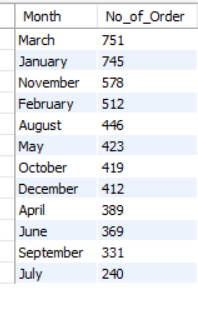
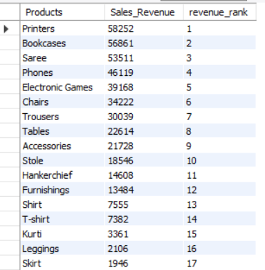
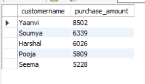

<<<<<<< HEAD
# E-Commerce Project

### Objective:
1.	Explore the structure of the dataset by understanding the relationships between tables.
2.	Formulate SQL queries to extract meaningful insights from the data.

```
select * from list_of_orders
```


```
select * from order_details
```


```
select * from sales_target
```


#### Analysis
1. Order_id is common in list_of_orders and order_details
2. Category is common in order_details and sales_target


#### Basic Queries:
1. Count of rows in each table

```
SELECT 'list_of_orders' AS Table_Name, COUNT(*) AS RowCount FROM list_of_orders
UNION
SELECT 'order_details' AS order_details, COUNT(*) AS RowCount FROM order_details
UNION
SELECT 'sales_target' AS sales_target, COUNT(*) AS RowCount FROM sales_target;
```


#### Customer Analysis:
•	Find the total number of customers.
```
Select distinct count(customername) as Total_no_of_customers from list_of_orders
```


•	Identify the top 5 states with the highest number of customers.
```
select state, count(customername) as no_of_customers from list_of_orders
group by state
order by no_of_customers desc
limit 5
```


•	Calculate the average order value for each customer.

```
Select customername, round(avg(amount),0) as Avg_Order_Value from
(select l.order_id, l.customername, o.amount from list_of_orders l
join order_details o on l.order_id = o.order_id) f
group by customername
```


#### Product Analysis:
•	Determine the total number of unique products.

```
Select count(distinct subcategory) as Count_of_Unique_products  from order_details

```


•	Find the top 10 best-selling products.
```
Select subcategory, sum(quantity) as Sales_Quantity from order_details
group by subcategory
order by sum(quantity) desc
limit 10
```


#### Order Analysis:
•	Find the total number of orders.
```
select count(order_id) as Total_No_of_orders from list_of_orders;

```



•	Identify the month with the highest number of orders.
```
select monthname(order_date) as Month, sum(quantity) as No_of_Order from (select l.order_id, l.order_date, o.amount, o.quantity from list_of_orders l left join order_details o on l.order_id = o.order_id) j
group by monthname(order_date)
order by sum(quantity) desc
```


#### Practice Questions: E-commerce Dataset
1.	Rank the products based on their total sales revenue. Include the product name, total sales revenue, and the rank.
```
select subcategory as Products, sum(amount) as Sales_Revenue, rank() over (order by sum(amount) desc) as revenue_rank from order_details
group by Products
```

2.	Find the top 5 customers with the highest cumulative purchase amount. Show customer ID, name, and the cumulative purchase amount.
```
select l.customername , sum(o.amount) as purchase_amount from list_of_orders l
join order_details o
on l.order_id =  o.order_id
group by l.customername, l.order_id
order by sum(o.amount) desc
limit 5;
```

3.	Calculate the running total of sales revenue for each product. Display the product name, date, and the running total of sales revenue.

4.	Identify customers who have placed orders with a total value greater than the average order value. Show customer ID, name, and total order value.
5.	Determine the difference in sales revenue from the previous day for each product. Show the product name, date, sales revenue, and the daily difference.
6.	List the customers who have made at least two purchases in the same day. Show customer ID, name, and the number of purchases.
7.	Calculate the total sales revenue for each month. Display the month name, year, and total sales revenue.
8.	Find products that have sales revenue higher than the average sales revenue. Display the product name, sales revenue, and the average sales revenue.
9.	Identify the average order value for each quarter. Display the quarter, year, and average order value.


=======
# E-Commerce Project

### Objective:
1.	Explore the structure of the dataset by understanding the relationships between tables.
2.	Formulate SQL queries to extract meaningful insights from the data.

```
select * from list_of_orders
```


```
select * from order_details
```


```
select * from sales_target
```


#### Analysis
1. Order_id is common in list_of_orders and order_details
2. Category is common in order_details and sales_target


#### Basic Queries:
1. Count of rows in each table

```
SELECT 'list_of_orders' AS Table_Name, COUNT(*) AS RowCount FROM list_of_orders
UNION
SELECT 'order_details' AS order_details, COUNT(*) AS RowCount FROM order_details
UNION
SELECT 'sales_target' AS sales_target, COUNT(*) AS RowCount FROM sales_target;
```


#### Customer Analysis:
•	Find the total number of customers.
```
Select distinct count(customername) as Total_no_of_customers from list_of_orders
```


•	Identify the top 5 states with the highest number of customers.
```
select state, count(customername) as no_of_customers from list_of_orders
group by state
order by no_of_customers desc
limit 5
```


•	Calculate the average order value for each customer.

```
Select customername, round(avg(amount),0) as Avg_Order_Value from
(select l.order_id, l.customername, o.amount from list_of_orders l
join order_details o on l.order_id = o.order_id) f
group by customername
```


#### Product Analysis:
•	Determine the total number of unique products.

```
Select count(distinct subcategory) as Count_of_Unique_products  from order_details

```


•	Find the top 10 best-selling products.
```
Select subcategory, sum(quantity) as Sales_Quantity from order_details
group by subcategory
order by sum(quantity) desc
limit 10
```


#### Order Analysis:
•	Find the total number of orders.

•	Calculate the average order value.
•	Identify the month with the highest number of orders.


>>>>>>> 8eaafcaced069f2fa227bf8f231560931c961723
