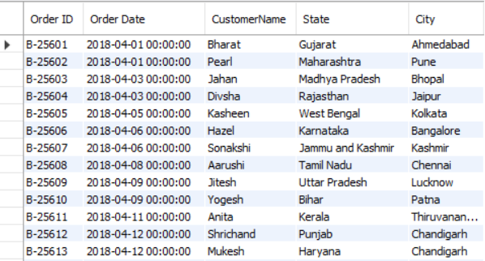
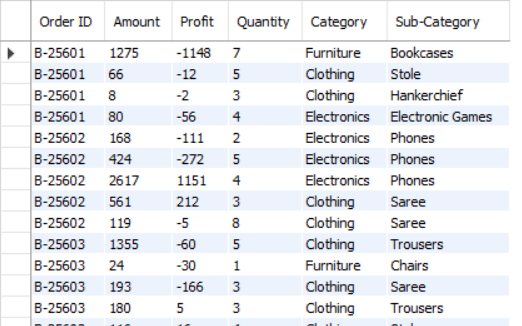
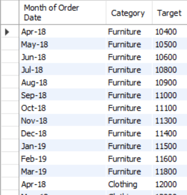
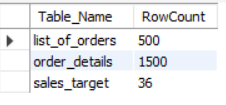
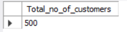
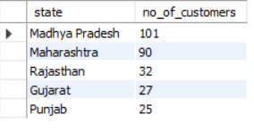
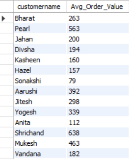
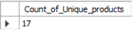
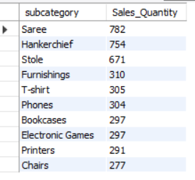

# E-Commerce Project

### Objective:
1.	Explore the structure of the dataset by understanding the relationships between tables.
2.	Formulate SQL queries to extract meaningful insights from the data.

```
select * from list_of_orders
```



```
select * from order_details
```



```
select * from sales_target
```




#### Analysis
1. Order_id is common in list_of_orders and order_details
2. Category is common in order_details and sales_target


#### Basic Queries:
1. Count of rows in each table

```
SELECT 'list_of_orders' AS Table_Name, COUNT(*) AS RowCount FROM list_of_orders
UNION
SELECT 'order_details' AS order_details, COUNT(*) AS RowCount FROM order_details
UNION
SELECT 'sales_target' AS sales_target, COUNT(*) AS RowCount FROM sales_target;
```


#### Customer Analysis:
•	Find the total number of customers.
```
Select distinct count(customername) as Total_no_of_customers from list_of_orders
```


•	Identify the top 5 states with the highest number of customers.
```
select state, count(customername) as no_of_customers from list_of_orders
group by state
order by no_of_customers desc
limit 5
```


•	Calculate the average order value for each customer.

```
Select customername, round(avg(amount),0) as Avg_Order_Value from
(select l.order_id, l.customername, o.amount from list_of_orders l
join order_details o on l.order_id = o.order_id) f
group by customername
```



#### Product Analysis:
•	Determine the total number of unique products.

```
Select count(distinct subcategory) as Count_of_Unique_products  from order_details

```


•	Find the top 10 best-selling products.
```
Select subcategory, sum(quantity) as Sales_Quantity from order_details
group by subcategory
order by sum(quantity) desc
limit 10
```


#### Order Analysis:
•	Find the total number of orders.

•	Calculate the average order value.
•	Identify the month with the highest number of orders.


